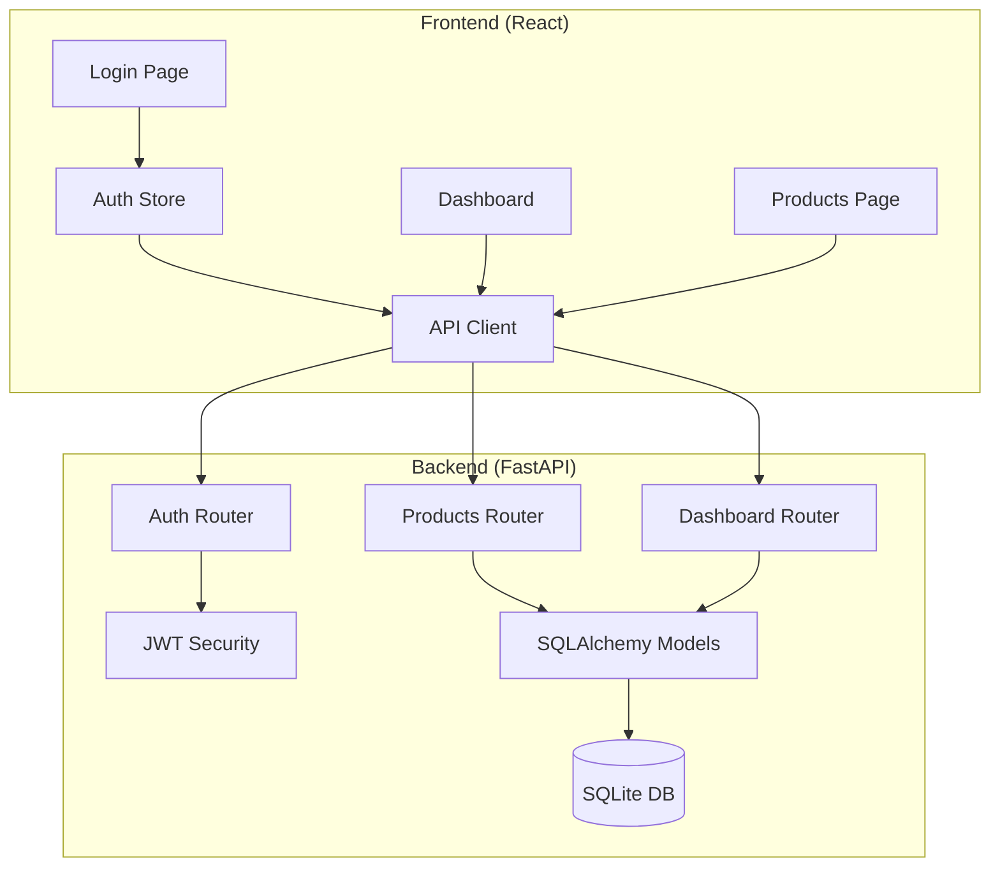

# Inventory Management Dashboard - Walkthrough

## Summary

Successfully implemented a full-stack **Inventory Management Dashboard** MVP with:

- **Backend**: FastAPI (Python) with SQLAlchemy 2.0, JWT authentication, and async SQLite
- **Frontend**: React 18 + TypeScript + Vite with Shadcn/UI, Tailwind CSS, and Recharts
- **Deployment**: Docker Compose with Nginx reverse proxy

## ✅ Verification Results

| Test | Status | Result |
|------|--------|--------|
| Backend Health | ✅ Pass | `{"status":"healthy","version":"1.0.0"}` |
| Login API | ✅ Pass | Returns JWT access + refresh tokens |
| Frontend Build | ✅ Pass | 2383 modules, 6.65s build time |
| TypeScript Check | ✅ Pass | No type errors |
| Dev Server | ✅ Pass | Running on `http://localhost:5173` |

---

## What Was Built

### Backend (FastAPI)

| Component | Files Created |
|-----------|---------------|
| **Config** | `config.py`, `database.py`, `.env.example` |
| **Models** | `user.py`, `category.py`, `product.py` |
| **Schemas** | `user.py`, `product.py`, `category.py`, `dashboard.py` |
| **Auth** | `security.py` (JWT + bcrypt), `dependencies.py` |
| **Routers** | `auth.py`, `users.py`, `products.py`, `categories.py`, `dashboard.py` |
| **Services** | `seed.py` (initial admin + demo data) |

**Key Features:**
- Async SQLAlchemy 2.0 with SQLite (migration-ready for PostgreSQL)
- JWT access + refresh tokens with automatic renewal
- Role-based access control (`AdminUser`, `CurrentUser` dependencies)
- Paginated product listing with search and filters
- CSV import/export for bulk operations
- Dashboard aggregation with role-aware stats (Staff can't see revenue)

---

### Frontend (React + TypeScript)

| Component | Files Created |
|-----------|---------------|
| **Config** | `package.json`, `tsconfig.json`, `vite.config.ts`, `tailwind.config.js` |
| **API** | `client.ts`, `auth.ts`, `products.ts`, `categories.ts`, `users.ts`, `dashboard.ts` |
| **Stores** | `authStore.ts`, `productStore.ts`, `uiStore.ts` |
| **UI** | `button.tsx`, `input.tsx`, `label.tsx`, `card.tsx`, `select.tsx`, `dialog.tsx` |
| **Layout** | `Sidebar.tsx`, `Header.tsx`, `ProtectedLayout.tsx` |
| **Pages** | `LoginPage.tsx`, `DashboardPage.tsx`, `ProductsPage.tsx`, `CategoriesPage.tsx`, `UsersPage.tsx` |

**Key Features:**
- Collapsible sidebar with role-based navigation
- Dark/light theme toggle with localStorage persistence
- JWT token auto-refresh in Axios interceptors
- Inline quantity editing for Staff users
- Recharts dashboard with bar chart (low stock) and pie chart (category values)
- Full CRUD dialogs for products, categories, and users

---

### Docker Configuration

| File | Purpose |
|------|---------|
| `backend/Dockerfile` | Python 3.11 + uvicorn |
| `frontend/Dockerfile` | Multi-stage build: Node → Nginx |
| `frontend/nginx.conf` | SPA fallback + API proxy |
| `docker-compose.yml` | Orchestration with persistent SQLite volume |

---

## File Structure

```
inventory-dashboard/
├── docker-compose.yml
├── .env.example
├── README.md
│
├── backend/
│   ├── Dockerfile
│   ├── pyproject.toml
│   ├── .env.example
│   └── app/
│       ├── main.py
│       ├── config.py
│       ├── database.py
│       ├── models/
│       ├── schemas/
│       ├── routers/
│       ├── services/
│       └── core/
│
└── frontend/
    ├── Dockerfile
    ├── nginx.conf
    ├── package.json
    ├── vite.config.ts
    ├── tailwind.config.js
    ├── index.html
    └── src/
        ├── App.tsx
        ├── main.tsx
        ├── index.css
        ├── api/
        ├── stores/
        ├── pages/
        ├── components/
        ├── lib/
        └── types/
```

---

## How to Start

### Option 1: Docker (Recommended)

```bash
cd inventory-dashboard
docker-compose up --build
```

- Frontend: http://localhost:3000
- API Docs: http://localhost:8000/docs

### Option 2: Development Mode

**Backend:**
```bash
cd backend
python -m venv .venv
.venv\Scripts\activate
pip install -e .
uvicorn app.main:app --reload
```

**Frontend:**
```bash
cd frontend
npm install
npm run dev
```

---

## Default Credentials

| Role | Email | Password |
|------|-------|----------|
| Admin | admin@example.com | admin123 |

Demo products are auto-seeded on first run.

---

## Next Steps

1. **Manual Testing**: Login, CRUD products, test role restrictions
2. **TypeScript Check**: Run `npm run build` in frontend to verify types
3. **Lint/Format**: Add ESLint and Prettier configs
4. **Production**: Update `JWT_SECRET` and add HTTPS

---

## Architecture Diagram


