# Phase 1: High-Level Architecture & Actors

## 👥 Actors (User Roles)

| Actor | Role Code | Description | Capabilities |
|-------|-----------|-------------|--------------|
| **Admin** | `admin` | Full system access | CRUD all entities, view financials, manage users |
| **Staff** | `staff` | Limited operational access | CRUD products/categories, view dashboard (no financials) |
| **System (AI)** | N/A | Automated background processes | Stock prediction, Natural Language Query parsing |

---

## 🧩 Core Modules (Backend Routers)

```mermaid
graph TB
    subgraph Frontend["🖥️ Frontend (React)"]
        LP[LoginPage]
        DP[DashboardPage]
        PP[ProductsPage]
        CP[CategoriesPage]
        UP[UsersPage]
    end

    subgraph API["⚡ API Layer (FastAPI)"]
        AUTH[auth.py]
        USERS[users.py]
        PRODUCTS[products.py]
        CATEGORIES[categories.py]
        DASHBOARD[dashboard.py]
        ANALYTICS[analytics.py]
        SEARCH[search.py]
    end

    subgraph Services["🤖 AI/Business Services"]
        LLM[llm_search.py<br/>Gemini AI NLP]
        PRED[prediction.py<br/>Stock Forecasting]
    end

    subgraph Data["💾 Data Layer"]
        PG[(PostgreSQL)]
        RD[(Redis Cache)]
    end

    LP --> AUTH
    DP --> DASHBOARD
    DP --> ANALYTICS
    PP --> PRODUCTS
    PP --> SEARCH
    CP --> CATEGORIES
    UP --> USERS

    SEARCH --> LLM
    ANALYTICS --> PRED

    AUTH --> PG
    PRODUCTS --> PG
    PRODUCTS --> RD
    DASHBOARD --> RD
```

---

## 📦 Module Breakdown

### 1. Authentication Module (`auth.py`)
- **Endpoints:** `/api/auth/login`, `/api/auth/refresh`, `/api/auth/logout`, `/api/auth/me`
- **Features:** JWT with HttpOnly cookies, Token refresh, Role-based access
- **Data:** `User` model (email, password, role, is_active)

### 2. User Management Module (`users.py`)
- **Endpoints:** CRUD on `/api/users`
- **Access:** Admin only
- **Features:** Create staff accounts, deactivate users

### 3. Inventory Module (`products.py`, `categories.py`)
- **Endpoints:** CRUD on `/api/products`, `/api/categories`
- **Features:** 
  - Product management (SKU, name, quantity, price, reorder_level)
  - Category hierarchy
  - Quantity adjustments with audit trail

### 4. Dashboard Module (`dashboard.py`)
- **Endpoints:** `/api/dashboard/stats`, `/api/dashboard/low-stock`, `/api/dashboard/category-value`
- **Features:**
  - Aggregated statistics (total products, categories, inventory value)
  - Low stock alerts
  - Category distribution charts

### 5. Analytics Module (`analytics.py`)
- **Endpoints:** `/api/analytics/forecast`, `/api/analytics/summary`
- **Features:**
  - AI-powered stock forecasting (days until stockout)
  - Reorder recommendations with urgency levels (Critical/Warning/OK)

### 6. AI Search Module (`search.py` + `llm_search.py`)
- **Endpoints:** `/api/search`
- **Features:**
  - Natural Language Query → Structured Filters (via Gemini AI)
  - Regex fallback when AI unavailable
  - Example: "show me electronics under $50 low stock" → `{category: "electronics", price_max: 50, stock_status: "low"}`

---

## 🔧 Infrastructure Components

| Component | Technology | Purpose |
|-----------|------------|---------|
| Cache | Redis (Upstash) | Rate limiting, Query caching |
| Rate Limiter | SlowAPI | 100 req/min per user |
| Database | PostgreSQL | Primary data store |
| AI Provider | Google Gemini | NLP query parsing, Forecast generation |

---

## ✅ Phase 1 Confirmation

**Please review the above and confirm:**
1. Are the 3 Actors (Admin, Staff, System) correct?
2. Are all 6 Modules captured accurately?
3. Any missing features or modules to add?

Once confirmed, proceed to **Phase 2: User Stories & Acceptance Criteria**.
