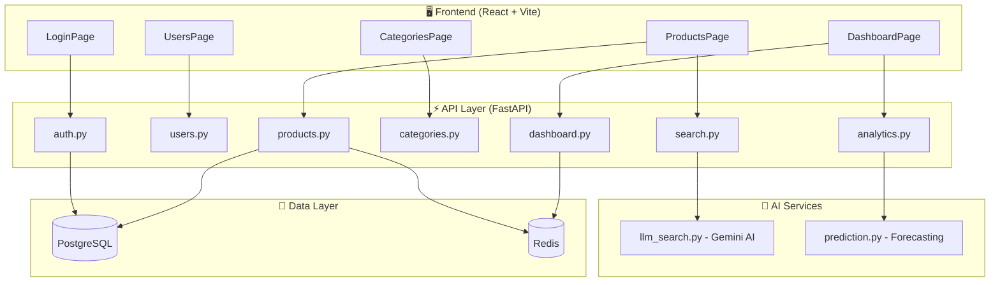

# PRODUCT_SPECS.md
## AI-Powered SaaS Inventory Dashboard - Product Requirements Document

**Version:** 1.0  
**Last Updated:** January 5, 2026  
**Tech Stack:** React, FastAPI, PostgreSQL, Redis, Docker, Gemini AI

---

# Table of Contents

1. [Executive Summary](#1-executive-summary)
2. [System Architecture](#2-system-architecture)
3. [User Stories & Acceptance Criteria](#3-user-stories--acceptance-criteria)
4. [Technical Specifications](#4-technical-specifications)
5. [API Reference](#5-api-reference)

---

# 1. Executive Summary

## 1.1 Product Overview

An AI-powered inventory management dashboard for small-to-medium businesses. Key differentiators:

- **Natural Language Search:** Ask questions like "show me cheap electronics" using Gemini AI
- **Predictive Analytics:** AI-driven stock forecasting with reorder recommendations
- **Role-Based Access:** Admin and Staff user tiers with appropriate permissions
- **Modern UX:** Premium dark/light themes with responsive design

## 1.2 Actors

| Actor | Role Code | Capabilities |
|-------|-----------|--------------|
| **Admin** | `admin` | Full CRUD, financials, user management |
| **Staff** | `staff` | Products/Categories CRUD, dashboard (no financials) |
| **System (AI)** | N/A | Stock prediction, NLP query parsing |

## 1.3 Core Modules

| Module | Description | Key Endpoints |
|--------|-------------|---------------|
| Authentication | JWT + HttpOnly cookies | `/auth/login`, `/auth/refresh`, `/auth/logout` |
| User Management | Admin-only CRUD | `/users` |
| Inventory | Products + Categories | `/products`, `/categories` |
| Dashboard | Stats, Alerts, Charts | `/dashboard/stats`, `/dashboard/low-stock` |
| Analytics (AI) | Forecasting | `/analytics/forecast` |
| AI Search | NLP to Filters | `/search/smart` |

---

# 2. System Architecture

## 2.1 High-Level Diagram



## 2.2 Data Models

### User
```
id: int (PK)
email: str (unique, indexed)
hashed_password: str
full_name: str
role: enum (admin, staff)
is_active: bool
created_at: datetime
```

### Product
```
id: int (PK)
sku: str (unique)
name: str
description: str
quantity: int
unit_price: decimal
low_stock_threshold: int
category_id: int (FK)
created_at: datetime
updated_at: datetime
```

### Category
```
id: int (PK)
name: str (unique)
description: str
```

### SalesOrder
```
id: int (PK)
product_id: int (FK)
quantity: int
order_date: datetime
```

---

# 3. User Stories & Acceptance Criteria

## 3.1 Authentication Module

### US-1.1: User Login
**As a** Staff or Admin user  
**I want to** log in with my email and password  
**So that** I can access the inventory dashboard securely

```gherkin
Scenario: Successful login
  Given I am on the login page
  When I enter valid credentials
  And I click "Sign In"
  Then I should be redirected to Dashboard
  And my name should appear in the header

Scenario: Invalid credentials
  Given I am on the login page
  When I enter invalid credentials
  Then I should see "Invalid credentials" error

Scenario: Automatic token refresh
  Given my access token has expired
  When I make an API request
  Then the system should refresh my token automatically
```

## 3.2 Inventory Module

### US-3.4: Adjust Quantity
**As a** Staff or Admin  
**I want to** adjust product quantity  
**So that** I can record stock changes

```gherkin
Scenario: Increase stock
  Given Product "Wireless Mouse" has quantity 10
  When I adjust by +50
  Then quantity should be 60

Scenario: Decrease stock
  Given Product "USB-C Hub" has quantity 20
  When I adjust by -15
  Then quantity should be 5
  And low stock warning should appear if below threshold
```

## 3.3 Dashboard Module

### US-5.1: Role-Based Statistics
```gherkin
Scenario: Staff user views dashboard
  Given I am logged in as Staff
  Then I should see: Total Products, Categories, Low Stock Alerts
  And I should NOT see: Inventory Value

Scenario: Admin user views dashboard
  Given I am logged in as Admin
  Then I should see ALL metrics including Inventory Value
```

## 3.4 AI Search Module (Critical)

### US-7.1: Natural Language Search
**As a** user  
**I want to** search using natural language  
**So that** I can find items without filter syntax

```gherkin
Scenario Outline: Parse natural language
  When I search "<query>"
  Then filters should be: <filters>

  Examples:
    | query                         | filters                                  |
    | show me electronics under $50 | category=electronics, max_price=50       |
    | low stock items               | low_stock=true                           |
    | expensive furniture           | category=furniture, sort=price desc      |

Scenario: AI fallback to regex
  Given Gemini API is unavailable
  When I search for "electronics"
  Then system should use regex fallback
  And parse_method should be "regex"

Scenario: Rate limiting
  Given I made 10 AI searches in 1 minute
  When I make another search
  Then I should receive 429 Too Many Requests
```

## 3.5 Analytics Module (AI)

### US-6.1: Stock Forecasting
```gherkin
Scenario: Urgency calculation
  Given product has:
    | Current Quantity | 10 |
    | Avg Daily Sales  | 5  |
  Then Days Until Stockout = 2
  And Urgency = "Critical" (< 7 days)

Scenario: No sales history
  Given product has no sales
  Then Avg Daily Sales = 0
  And Urgency = "OK"
```

---

# 4. Technical Specifications

## 4.1 Performance

| Aspect | Implementation |
|--------|----------------|
| Caching | Redis (Upstash) for rate limiting |
| Database | PostgreSQL + async SQLAlchemy |
| API Response | < 100ms CRUD, < 3s AI operations |

## 4.2 Security

### JWT Configuration
```yaml
Algorithm: HS256
Access Token: 30 minutes (sessionStorage)
Refresh Token: 7 days (HttpOnly cookie)
```

### Rate Limiting
| Endpoint | Limit |
|----------|-------|
| Default | 100/minute |
| AI Search | 10/minute |
| Auth | 20/minute |

### Password Hashing
- Algorithm: bcrypt
- Max length: 72 bytes (auto-truncated)

## 4.3 AI Logic

### Natural Language Parser
```
Query → [Gemini 2.0 Flash] → Parsed Filters
              ↓ (fail)
        [Regex Fallback] → Parsed Filters
```

### Stock Forecasting Algorithm
```python
avg_daily_sales = total_sales_30_days / 30
days_until_stockout = current_quantity / avg_daily_sales
suggested_reorder = (14 * avg_daily_sales) - current_quantity

# Urgency
if days < 7: "critical"
elif days < 14: "warning"
else: "ok"
```

## 4.4 Infrastructure

### Environment Variables
```bash
DATABASE_URL=postgresql+asyncpg://...
REDIS_URL=redis://...
JWT_SECRET=your-secret
GEMINI_API_KEY=your-key
```

### Deployment Targets
| Platform | Backend | Frontend | DB | Cache |
|----------|---------|----------|----|-------|
| Render | ✅ | ✅ | ✅ | Upstash |
| Railway | ✅ | ✅ | ✅ | ✅ |

---

# 5. API Reference

## 5.1 Authentication

| Method | Endpoint | Description |
|--------|----------|-------------|
| POST | `/api/auth/login` | Login, returns access token |
| POST | `/api/auth/refresh` | Refresh access token |
| POST | `/api/auth/logout` | Clear refresh cookie |
| GET | `/api/auth/me` | Get current user |

## 5.2 Users (Admin Only)

| Method | Endpoint | Description |
|--------|----------|-------------|
| GET | `/api/users` | List all users |
| POST | `/api/users` | Create user |
| GET | `/api/users/{id}` | Get user |
| PUT | `/api/users/{id}` | Update user |
| DELETE | `/api/users/{id}` | Delete user |

## 5.3 Products

| Method | Endpoint | Description |
|--------|----------|-------------|
| GET | `/api/products` | List (paginated, filterable) |
| POST | `/api/products` | Create product |
| GET | `/api/products/{id}` | Get product |
| PUT | `/api/products/{id}` | Update product |
| DELETE | `/api/products/{id}` | Delete product |
| PATCH | `/api/products/{id}/quantity` | Adjust quantity |

## 5.4 Categories

| Method | Endpoint | Description |
|--------|----------|-------------|
| GET | `/api/categories` | List all |
| POST | `/api/categories` | Create |
| PUT | `/api/categories/{id}` | Update |
| DELETE | `/api/categories/{id}` | Delete |

## 5.5 Dashboard

| Method | Endpoint | Description |
|--------|----------|-------------|
| GET | `/api/dashboard/stats` | Aggregate statistics |
| GET | `/api/dashboard/low-stock` | Low stock products |
| GET | `/api/dashboard/category-value` | Category distribution |

## 5.6 Analytics (AI)

| Method | Endpoint | Description |
|--------|----------|-------------|
| GET | `/api/analytics/forecast` | Stock forecasts |
| GET | `/api/analytics/summary` | Inventory health summary |

## 5.7 Search (AI)

| Method | Endpoint | Description |
|--------|----------|-------------|
| POST | `/api/search/smart` | Natural language search |
| GET | `/api/search/products?q=` | Simple text search |

---

# Appendix

## A. Glossary

| Term | Definition |
|------|------------|
| SKU | Stock Keeping Unit - unique product identifier |
| Low Stock | Quantity ≤ threshold |
| Stockout | Days until quantity reaches 0 |
| Urgency | Critical (< 7d), Warning (< 14d), OK (≥ 14d) |

## B. Version History

| Version | Date | Changes |
|---------|------|---------|
| 1.0 | 2026-01-05 | Initial release |

---

**Document Status:** ✅ Complete  
**Source of Truth:** This document serves as the master reference for all product, technical, and business requirements.
